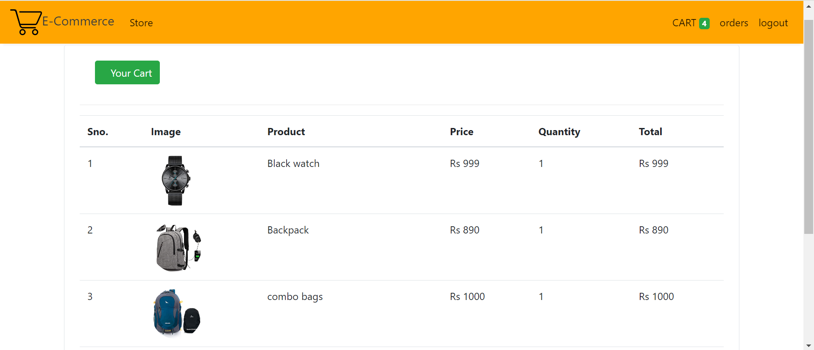

# E-commerceWebsite

This project revolves around creating an E-commerce Website, a virtual platform where users can browse through a diverse range of products available for purchase. The website facilitates online shopping by integrating a user-friendly shopping cart feature, allowing customers to add selected items for eventual order confirmation. Developed utilizing Django, a Python web framework, the system streamlines the shopping experience, ensuring seamless navigation and efficient transaction processing for users.

1. Clone this repository into a folder on your computer
2. Download Python
3. Open terminal inside the folder with code.
4. Type pip install -r requirements.txt in the terminal window to install all the requirements to run the app.
5. Type python manage.py runserver to start a localhost server for the app.
6. The API is started and now you can use the API routes to give requests.
7. DB Browser for SQLite used to manage order data,login data,cart data,and signup data.

ScreenShots of The Project on Browser:
1.Home Page:

2.Login Page:

3.SignUp Page:

4.Cart:

5.Database Data(Orders):

